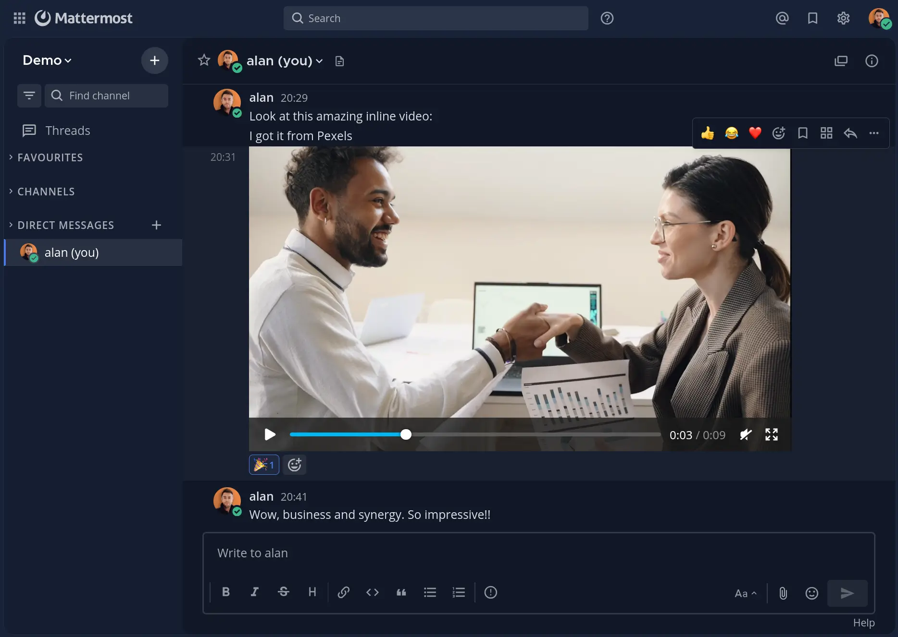

# Mattermost Video Player Plugin

Mattermost plugin to play video files (MP4, WEBM, MOV, M4V) inline in channel posts on Mattermost web and desktop, instead of showing them as a download-only file attachment. Matches the inline video playback behaviour of the Mattermost mobile app.

The HTML5 player provides standard controls including fullscreen, seek, volume, and playback speed. The plugin is tiny - just [40 lines of vanilla Javascript](https://github.com/alangrainger/mattermost-video-player-plugin/blob/main/webapp/main.js) (plus comments).



## Why doesn't Mattermost play videos inline?

Out of the box, Mattermost's web and desktop clients render uploaded video files as a generic file-attachment chip — the user has to click to open a preview modal, or download the file, before it will play. The Mattermost mobile app already plays videos inline in the channel stream; the web/desktop clients do not. This plugin closes that gap by inserting an HTML5 `<video>` element under each video attachment so it plays in place, the same way images already do.

## Install

You will need Mattermost system-admin access.

1. Download the latest `mattermost-video-player-<version>.tar.gz` from the [GitHub Releases page](https://github.com/alangrainger/mattermost-video-player-plugin/releases).
2. In Mattermost, go to **System Console > Plugin Management**. Make sure **Enable Plugin Uploads** is set to *true*.
3. Under **Upload Plugin**, choose the downloaded tar.gz and click **Upload**.
4. In the **Installed Plugins** list, find "Video Player" and click **Enable**.
5. Refresh the Mattermost browser tab (Ctrl+Shift+R / Cmd+Shift+R) so the new webapp bundle is picked up.

After enabling, any post containing a video attachment will display an inline player in place of the file chip.

To uninstall: in the same System Console page, click **Disable** then **Remove** on the plugin row.

## How it works

A small CSS rule hides any file-attachment chip whose icon class identifies it as a video. A MutationObserver then watches for those chips appearing in the DOM and, for each, inserts a sibling `<video controls>` element pointing at the Mattermost file URL.

This is approximately 40 lines of vanilla JavaScript with no build step. The plugin ships as a single JS file plus `plugin.json`.

## Build

```
make bundle
```

Produces `dist/mattermost-video-player.tar.gz`, ready to upload via **System Console > Plugin Management > Upload Plugin**.

## Compatibility

Targets Mattermost server v10 and later. Relies on the current `.post-image__column` / `.post-image__download` / `.file-icon.video` DOM shape in the webapp. If Mattermost refactors that markup, this plugin will silently no-op (chips will continue to render as before). Also requires a browser supporting CSS `:has()` (Chrome 105+, Firefox 121+, Safari 15.4+).

## What video formats are supported?

The browser's native `<video>` element decides what plays. MP4 (H.264/AAC) is the safest bet for cross-browser playback. WEBM works in Chromium and Firefox. MOV and M4V depend on the browser's codec support. Anything Mattermost classifies as a video file is offered to the player; if the browser can't decode it, the player shows its standard "can't play" state and the user can still download the file via right-click.

## Where does this plugin work?

Anywhere Mattermost renders a post — main channel stream, right-hand thread pane, direct messages, and group messages. There is nothing channel-specific or thread-specific in the plugin; it observes every post in the DOM.
